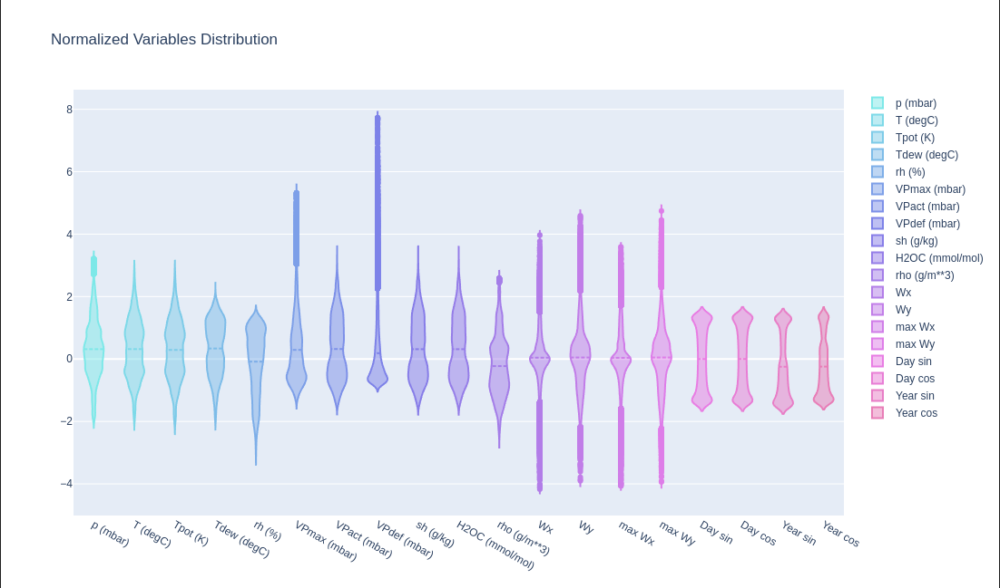

Here is an overview of the contents of the "Weather Forecasting" notebook, which compares different models such as Dense, Convolutional+Dense, LSTM, GRU, and Attention LSTM:

1. **Introduction and Setup**
   - Description of the project for weather forecasting using various deep learning models.
   - Importing necessary libraries such as `pandas`, `numpy`, `matplotlib`, `tensorflow`, and `sklearn`.

2. **Data Preprocessing**
   - Loading weather data using `pandas`.
   - Data exploration and visualization using `matplotlib`.
   - Data normalization and splitting into training and testing sets.

3. **Model Definitions**
   - **Dense Neural Network (DNN)**: A simple fully connected network.
   - **Convolutional Neural Network (CNN) + Dense**: Combines convolutional layers with dense layers for feature extraction and prediction.
   - **LSTM**: Long Short-Term Memory network for capturing temporal dependencies in sequential data.
   - **GRU**: Gated Recurrent Unit, a simpler alternative to LSTM with similar performance.
   - **Attention LSTM**: LSTM with an attention mechanism to focus on important time steps.

4. **Model Training and Evaluation**
   - Training each model on the preprocessed weather data.
   - Evaluation of models using metrics such as Mean Squared Error (MSE).
   - Visualization of training history and prediction results.

5. **Comparison of Results**
   - Comparison of models based on performance metrics.
   - Discussion on the advantages and disadvantages of each model for weather forecasting.

Would you like to explore or run specific sections or models from this notebook?