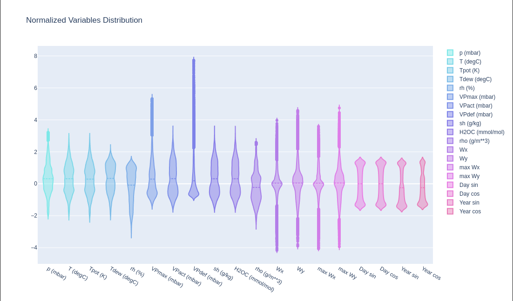

# Advanced Weather Forecasting with Deep Learning

A weather forecasting project that leverages the power of deep learning to predict future weather conditions with high accuracy. By comparing multiple advanced neural network architectures.

---

## Table of Contents

- [Project Overview](#project-overview)
- [Deep Learning Models](#deep-learning-models)
  - [Dense Neural Network (DNN)](#dense-neural-network-dnn)
  - [Convolutional Neural Network + Dense (CNN + DNN)](#convolutional-neural-network--dense-cnn--dnn)
  - [Long Short-Term Memory (LSTM)](#long-short-term-memory-lstm)
  - [Gated Recurrent Unit (GRU)](#gated-recurrent-unit-gru)
  - [Attention LSTM](#attention-lstm)
- [Results](#results)
- [Project Architecture](#project-architecture)
- [License](#license)
- [References](#references)

---

## Project Overview

This project is designed to harness various deep learning techniques to forecast weather patterns accurately. Using the [Jena Climate Dataset](https://www.kaggle.com/datasets/mnassrib/jena-climate), this project explores and compares the performance of different neural network architectures in predicting future weather conditions based on historical data.

### Objectives

- **Compare Multiple Models**: Evaluate the effectiveness of various deep learning models in weather forecasting.
- **Enhance Prediction Accuracy**: Identify the model that provides the highest accuracy and reliability.
- **Data-Driven Insights**: Gain insights into how different architectures handle temporal and spatial data in weather prediction.

---

## Deep Learning Models

### Dense Neural Network

A **Dense Neural Network** serves as the baseline model in this project. It consists of fully connected layers that process input features to make predictions. While simple, DNNs can capture complex relationships in the data but may struggle with temporal dependencies inherent in weather data.

**Key Characteristics:**
- **Architecture**: Multiple fully connected layers with activation functions.
- **Strengths**: Simplicity and ease of implementation.
- **Limitations**: May not effectively capture sequential patterns in data.

### Convolutional Neural Network + Dense (CNN + DNN)

The **CNN + DNN** model integrates convolutional layers with dense layers to enhance feature extraction from the data. Convolutional layers can capture spatial hierarchies, which is beneficial when dealing with multi-dimensional weather data.

**Key Characteristics:**
- **Architecture**: Convolutional layers followed by fully connected dense layers.
- **Strengths**: Improved feature extraction and handling of spatial data.
- **Limitations**: Increased complexity compared to pure DNNs.

### Long Short-Term Memory (LSTM)

**LSTM** networks are a type of recurrent neural network (RNN) designed to capture long-term dependencies in sequential data. They are particularly effective in modeling time-series data like weather patterns.

**Key Characteristics:**
- **Architecture**: Recurrent layers with memory cells to retain information over time.
- **Strengths**: Excellent at capturing temporal dependencies and patterns.
- **Limitations**: Computationally intensive and may require extensive training data.

### Gated Recurrent Unit (GRU)

**GRU** is a simplified version of LSTM that combines the forget and input gates into a single update gate. This reduces the complexity while maintaining performance in capturing temporal dependencies.

**Key Characteristics:**
- **Architecture**: Recurrent layers with gating mechanisms.
- **Strengths**: Faster training and fewer parameters compared to LSTM.
- **Limitations**: Slightly less expressive than LSTM in some scenarios.

### Attention LSTM

The **Attention LSTM** model enhances the traditional LSTM by incorporating an attention mechanism. This allows the model to focus on specific parts of the input sequence that are more relevant for making predictions, improving performance on complex tasks.

**Key Characteristics:**
- **Architecture**: LSTM layers with an added attention mechanism.
- **Strengths**: Improved focus on important time steps, leading to better performance.
- **Limitations**: Increased architectural complexity and computational requirements.

---

## Results

The following sections present the performance metrics and visualizations comparing the different models used in **ClimaPredict AI**.

### Model Performance

Each model was evaluated using **Mean Squared Error (MSE)** to assess prediction accuracy. The results indicate varying levels of performance across different architectures.

### Prediction Comparison

Visualizations of the models' predictions against actual weather data.

---

## License

This project is licensed under the [MIT License](LICENSE).

---

## References

- [Jena Climate Dataset](https://www.kaggle.com/datasets/mnassrib/jena-climate)
- [Deep Learning for Time Series Forecasting](https://www.tensorflow.org/tutorials/structured_data/time_series)
- [Understanding LSTM Networks](https://colah.github.io/posts/2015-08-Understanding-LSTMs/)
- [Attention Mechanism in Neural Networks](https://towardsdatascience.com/attention-mechanism-8eae7f91c9a5)
- [GRU vs LSTM](https://machinelearningmastery.com/understanding-the-difference-between-lstm-and-gru-recurrent-neural-networks/)
- [Convolutional Neural Networks](https://www.tensorflow.org/guide/keras/sequential_model)

---
