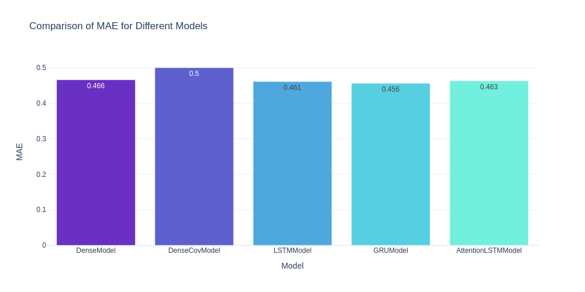
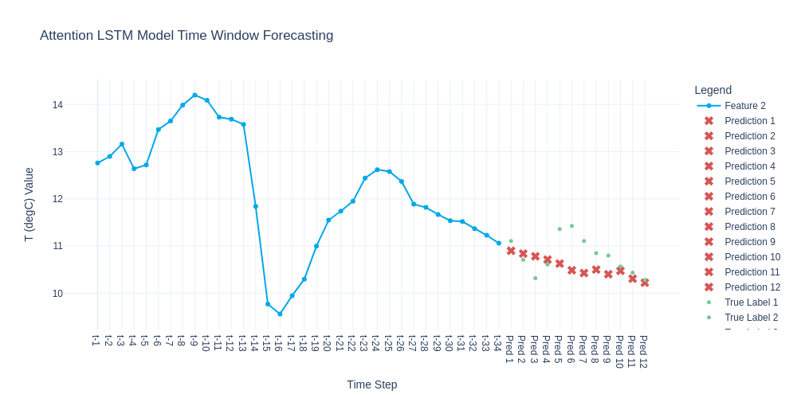

<h1 align="center">
Advanced Weather Forecasting with Deep Learning
</h1>
<p align="center">
  
</p>

---

## Overview

**Advanced Weather Forecasting with Deep Learning** leverages state-of-the-art neural network architectures to predict future weather conditions with high accuracy. Using historical data from the [Jena Climate Dataset](https://www.kaggle.com/datasets/mnassrib/jena-climate), this project explores and compares various deep learning models—all within an interactive, self-contained Jupyter Notebook.

---

## Built With

<p align="center">
  <a href="https://www.python.org/">
    
  </a>
  <a href="https://pytorch.org/">
    
  </a>
</p>

Harnessing the power of **Python** and **PyTorch**, this project examines a spectrum of deep learning models tailored for time-series weather forecasting.

---

## Deep Learning Models

- **Dense Neural Network (DNN):** A baseline model with fully connected layers to capture intricate data relationships.
- **CNN + DNN:** Combines convolutional layers for spatial feature extraction with dense layers.
- **Long Short-Term Memory (LSTM):** Captures long-term dependencies in sequential data.
- **Gated Recurrent Unit (GRU):** A streamlined alternative to LSTM for efficient training.
- **Attention LSTM:** Enhances LSTM by focusing on the most relevant time steps for improved predictions.

---

## Results

The performance of each model is evaluated using Mean Squared Error (MSE), with visualizations comparing model predictions against actual weather data.

<p align="center">
  
</p>

<p align="center">
  
</p>

---

## Getting Started

1. **Clone the Repository:**
   ```bash
   git clone https://github.com/BrunooCS/Weather-forecasting-with-Recurrent-Neural-Networks.git
   ```
2. **Open the Notebook:**
   Launch Jupyter Notebook (or your preferred environment) and open `Weather Forecasting.ipynb`.
3. **Run & Explore:**
   Follow the in-notebook instructions to train, evaluate, and compare the various deep learning models.

> **Tip:** The notebook is self-contained with code and detailed explanations, ensuring an intuitive learning experience.

---

## License

This project is open-sourced under the [MIT License](LICENSE).

---

## References

- [Jena Climate Dataset](https://www.kaggle.com/datasets/mnassrib/jena-climate)
- [Deep Learning for Time Series Forecasting](https://www.tensorflow.org/tutorials/structured_data/time_series)
- [Understanding LSTM Networks](https://colah.github.io/posts/2015-08-Understanding-LSTMs/)
- [Attention Mechanism in Neural Networks](https://towardsdatascience.com/attention-mechanism-8eae7f91c9a5)
```
